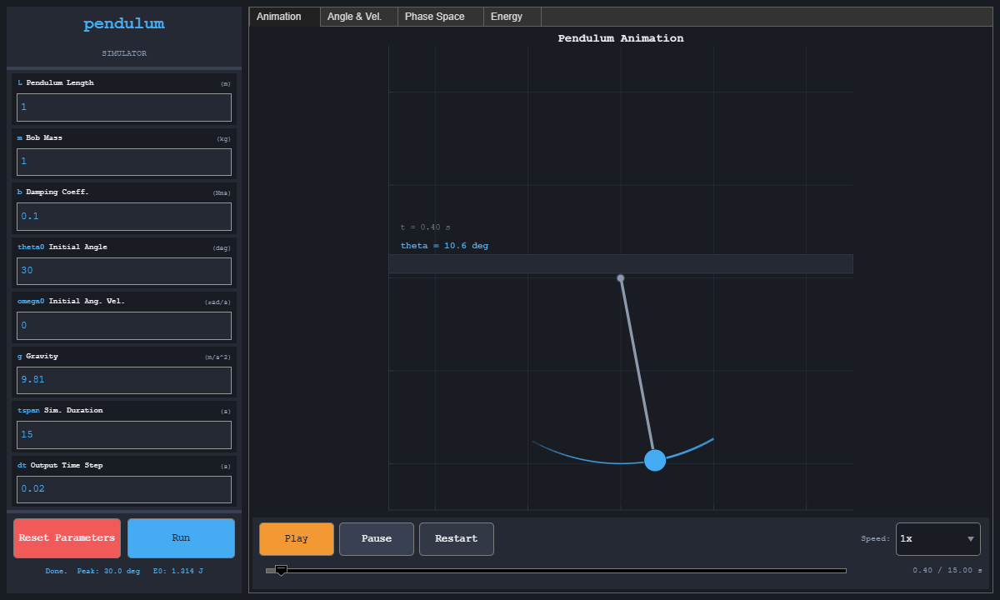
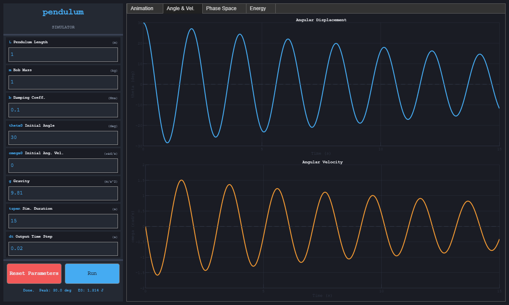
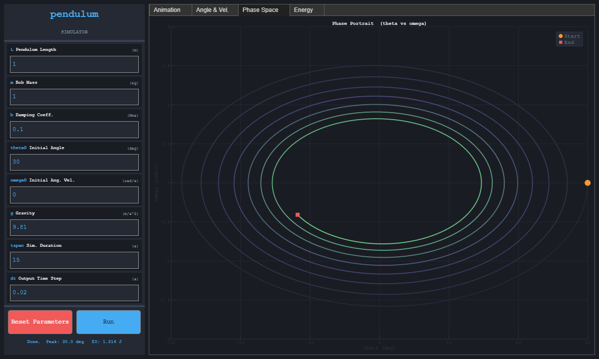
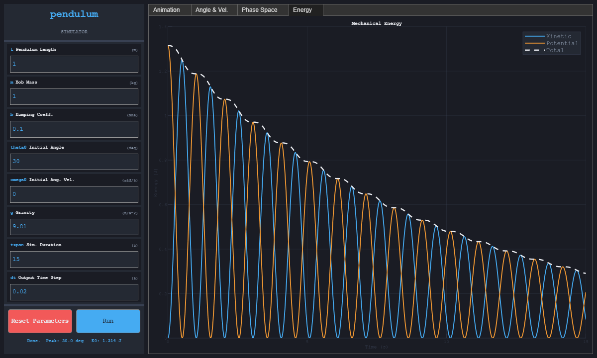

# Pendulum Simulator

An interactive MATLAB application for exploring a damped nonlinear pendulum. It includes animation, angle and angular-velocity plots, a phase portrait, and mechanical-energy plots.

## Screenshots

| Animation | Angle and angular velocity |
| --- | --- |
|  |  |
| Phase portrait | Mechanical energy |
|  |  |

The screenshots show the default case: `L = 1 m`, `m = 1 kg`, `b = 0.1 N m s`, `theta0 = 30 deg`, `g = 9.81 m/s^2`, and a 15-second simulation.

## Requirements

- MATLAB R2019b or newer
- No additional toolboxes

## Run

Open MATLAB in the project directory and enter:

```matlab
pendulum_simulator
```

Set the physical parameters, select **Run**, and use the animation controls to play, pause, restart, scrub, or change playback speed.

## Mathematical model

The simulator solves

```text
theta'' + b/(m L^2) theta' + g/L sin(theta) = 0
```

where `L` is length, `m` is bob mass, `b` is rotational damping, and `g` is gravitational acceleration. `ode45` handles ordinary cases and `ode15s` handles highly damped, stiff cases. Potential energy is measured relative to the pendulum's lowest position.

## Tests

Run the complete suite with:

```matlab
results = runtests("tests");
assertSuccess(results)
```

The tests cover timing, conservation of energy, damping, geometry, validation, stiff parameters, and key UI behavior.

Latest MATLAB R2025b run:

| Result | Value |
| --- | ---: |
| Tests passed | 11 / 11 |
| Failed or incomplete | 0 |
| Undamped relative energy variation | `3.60e-9` |
| 5-degree period error against the small-angle formula | `0.0714%` |
| Default output | 751 samples ending at exactly 15 s |

See the [complete test summary](docs/test-results.md) and [sample numerical output](docs/sample-output.csv).

## Project structure

- `pendulum_simulator.m` builds and controls the UI.
- `pendulum_solve.m` validates parameters and computes the numerical solution.
- `tests/` contains MATLAB unit tests.
- `docs/` contains screenshots and captured validation output.